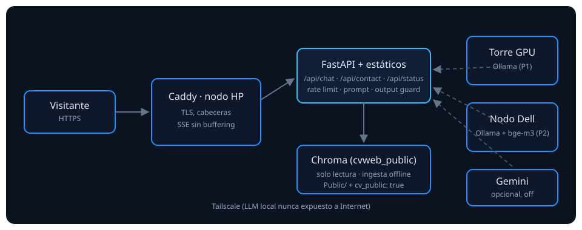

# CV Web — portfolio con asistente de IA self-hosted

[](https://github.com/rufae/CV-Web/actions/workflows/backend.yml)
[](https://github.com/rufae/CV-Web/actions/workflows/frontend.yml)

Portfolio personal (React + FastAPI) con **chatbot con RAG sobre un vault
Obsidian público**, enrutado de LLM entre nodos propios (torre/Dell) y
despliegue self-hosted en un nodo HP. El objetivo del proyecto es demostrar
ingeniería de IA aplicada: recuperación con umbrales calibrados, guardarraíles
contra inyección y fuga de datos, evaluación reproducible y operación con
failover.

## Qué demuestra

- **RAG real**: extracción con allow-list (`Public/` + `cv_public: true`),
  redacción de datos sensibles, chunking Markdown, embeddings `bge-m3` y Chroma.
- **Router híbrido**: prioridad torre GPU → nodo Dell → Gemini opcional, con
  health checks con histéresis, circuit breaker y failover **solo antes del
  primer token**.
- **Seguridad**: sanitización, prompt endurecido con canario, output guard
  (fuga de prompt/PII/URLs), rate limit, presupuesto diario, contacto con
  honeypot/Turnstile y outbox con reintentos.
- **Evaluación**: dataset dorado (49 casos), `recall@5=1.000`,
  `refusal_recall=1.000`, 0 fugas (informe versionado en `eval/reports/`).
- **Operación**: releases con rollback, métricas Prometheus, health profundo,
  backups, runbook y escenarios de caos documentados.

## Arquitectura



Caddy (TLS, cabeceras, SSE sin buffering) → FastAPI en el nodo HP (estáticos +
API + Chroma) → Ollama en la torre/Dell por Tailscale (LLM nunca expuesto).

## Quickstart local

```bash
# Backend
cd backend && python3 -m venv venv && source venv/bin/activate
pip install -r requirements.lock -r requirements-dev.lock
cp .env.example .env            # rellena EMAIL, PASSWORD_APPLICATION, LLM_*, EMBED_*
uvicorn app.main:app --port 8000

# Ingesta del vault público (una vez)
python scripts/ingest_public_vault.py --manifest ../data/ingest_manifest.json

# Frontend
cd ../frontend && npm ci && npm run dev
```

Tests: `cd backend && pytest` · `cd frontend && npm run test` ·
E2E: `cd frontend && npm run test:e2e` · Evaluación:
`python eval/run_eval.py --retrieval-only` · Consistencia:
`python eval/check_consistency.py`.

## Estructura

```
backend/   FastAPI (app/), tests/, scripts/ (ingesta, facts), locks reproducibles
frontend/  React 19 + Vite 7 (features/, shared/, content/, e2e/)
eval/      dataset.jsonl, redteam.jsonl, run_eval.py, check_consistency.py, reports/
deploy/    systemd, Caddyfile, deploy.sh (releases+rollback), backup.sh
docs/      architecture, runbook, security, evaluation, privacy, resilience, ADRs
```

## Documentación

- [`docs/architecture.md`](docs/architecture.md) · [`docs/runbook.md`](docs/runbook.md)
- [`docs/security.md`](docs/security.md) · [`docs/evaluation.md`](docs/evaluation.md)
- [`docs/privacy.md`](docs/privacy.md) · [`docs/accessibility.md`](docs/accessibility.md)
- [`docs/resilience.md`](docs/resilience.md) · ADRs en [`docs/adr/`](docs/adr/)

## Licencia

Código bajo licencia MIT (ver [`LICENSE`](LICENSE)). El **contenido personal**
(CV en PDF, fotografía, textos del portfolio y `facts.json`) queda excluido de
la licencia y no puede reutilizarse.
